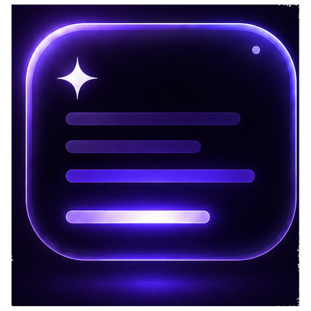

<div align="center">
  

  <h1>LumiCue · 灵光提示</h1>
  <p><strong>隐形悬浮提词器 — 一块只有你看得到的毛玻璃小窗。</strong></p>

  <p>
    <a href="./README.md">🇬🇧 English</a>
  </p>

  <p>
    ⚠️ <strong>仅支持 macOS。</strong>
  </p>
</div>

---

## 关于

LumiCue 是一个小小的提词器。你录视频、做直播，眼前有稿子要念——但你不想让观众看到。LumiCue 就是一块半透明的毛玻璃窗，浮在你的屏幕上方。你看着它念，观众什么都看不见。

关掉窗口就退出，没有菜单栏，没有状态图标——干干净净一块玻璃，帮你盯着镜头把稿念顺。

---

## ✅ 最新更新：v1.24.1

- **全屏演示也能浮在上面**——PowerPoint / 演示文稿全屏播放时，LumiCue 会尽量保持在幻灯片上方，不再一全屏就找不到提词窗。
- **胶囊态进度条也能拖动**——窗口收起成窄条之后，底部迷你进度条现在也可以点击和拖动，和大框里的进度条一样能直接跳到稿子任意位置。

---

## ✨ 为什么叫这个名字

**Lumi** 来自 luminous——微微发着光。**Cue** 是你的提词、你的下一句。

中文名叫「灵光提示」——念稿卡壳时，那句词刚好亮在眼前，像脑子里灵光一闪。

---

## 📸 产品预览


---

## 💜 它长什么样

- **毛玻璃**半透明底层——背后内容透得过来，文字却清清楚楚
- **彩虹流光描边**——靛蓝→紫→粉红，缓缓沿着边框流转
- **发光的进度条**，前端一颗脉冲小彗星往前跑
- **天色随念稿进度变化**——白天→黄昏→黑夜，陪你走完一段稿子
- **12 种柔和字色**——念久了眼睛不累

---

## 🧩 它能做什么

### 📺 天生隐形
窗口不会被录屏、直播、截图拍到。你的观众**永远**看不到它。只有你看得到。

现在也更适合全屏演示：PPT 全屏播放时，LumiCue 仍然可以浮在幻灯片上方，只给你自己看。

### 🫧 两种形态：念稿态 & 胶囊态
- **念稿态（大框）**：可拖拽调大小，居中滚动文字 + 全部控制 + 进度轨 + 救场面板
- **胶囊态（窄条）**：一条很窄的横条，小字 2–3 行 + 迷你控制 + 可拖动迷你进度条——拖到镜头画面角落，几乎不占地方

### 🎚️ 右下角拖拽调大小
按住窗口右下角直接拖——窗口自由缩放，字号自动跟着适配。跟调一个普通窗口一样顺手。

### 🎨 字体颜色格式随便换
- 12 种系统字体随意切
- 12 种文字颜色，点一下换一个，即时生效
- 字号独立微调（A− / A+），不跟窗口大小绑定

### 📜 滚动条随手拖
拖底部的进度条就能跳到稿子里的任意位置。念稿态和胶囊态都能拖，不用为了找位置再把窗口展开。

### ↩️ 念错了随时退
暂停一下，救场面板自动弹出：
- **↺ 重念这句**——当前句从头来
- **← 退 N 句**——退 1 句、2 句…… 累加计数，想退多远退多远
- **▶ 继续**——接着往下念

### 📝 粘贴即念
- `⌘V` 直接把稿子粘进来，当场显示
- 右键菜单导入 `.txt` 文件
- 自动清掉所有看不见的空格（零宽空格、全角空格、NBSP……全删干净），标点和换行保留

### 🎤 语音跟随（实验功能）
内置离线语音识别——数据不出你的电脑。你开口念，字幕跟着往下走。

### 🌐 中英一键切换
控制条一个按钮切换所有按钮语言。按钮显示的是**对面的语言**——中文界面显示"EN"，英文界面显示"中"。

---

## ⌨️ 快捷键

| 操作 | 按键 |
| ---- | ---- |
| 暂停 / 播放 | `空格` |
| 回退一句 | `↑` |
| 前进一句 | `↓` |
| 粘贴稿本 | `⌘V` |

---

## 🔧 构建

> 需要 **macOS 13.0** 或更高版本。

```bash
git clone <仓库地址>
cd LumiCue
open lumicue/LumiCue.xcodeproj
```

1. 选择 **LumiCue** scheme
2. 编译（⌘B）并运行（⌘R）
3. 提词器窗口立即弹出——就这样

### 打包 DMG

```bash
cd lumicue
./scripts/package-dmg.sh
```

生成的安装包会放在 `lumicue/build/` 目录下，例如 `LumiCue-v1.0.0.dmg`。

如果没有 Apple Developer 签名证书，这个 DMG 适合自己测试或小范围分发；公开下载版本建议再做签名和公证。

### 发布下载版

推送版本标签后，GitHub Actions 会自动生成 DMG 并上传到 Releases：

```bash
git tag v1.0.0
git push origin v1.0.0
```

---

## 👻 已知问题：字幕重影

滚动时，文字可能有轻微的重影/双像——高速滚动或低刷新率外接显示器上更明显。

大概率是 `CATextLayer` 合成和毛玻璃 `NSVisualEffectView` 底层在渲染管线里的交互问题。

**欢迎 PR！** 一些值得尝试的方向：
- 降低毛玻璃底层更新频率
- 文字渲染切到 `NSTextField` 或带 `drawsAsynchronously` 的 `CALayer`
- 帧同步的 `CATransaction` flush
- `CVDisplayLink` 对齐刷新的滚动

---

## 📄 许可证

BSD 3-Clause License。详见 [LICENSE](LICENSE)。
