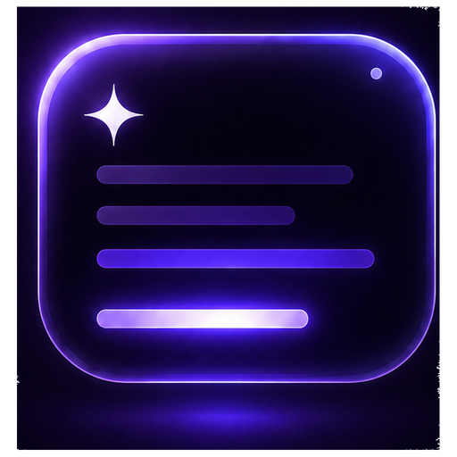

<div align="center">
  

  <h1>LumiCue · 灵光提示</h1>
  <p><strong>隐形悬浮提词器 — 一块只有你看得到的毛玻璃小窗。</strong></p>

  <p>
    <a href="./README.md">🇬🇧 English</a>
  </p>

  <p>
    ⚠️ <strong>仅支持 macOS。</strong>
  </p>
</div>

---

## 📥 下载 / Download

| 你的 Mac 芯片 Your chip | 下载 Download |
|---|---|
| **Apple 芯片** M1 / M2 / M3 / M4 (2020 年后) | [LumiCue-v1.25.0-AppleSilicon.zip](https://github.com/yismo1359413951/LumiCue/raw/master/downloads/LumiCue-v1.25.0-AppleSilicon.zip) |
| **Intel 芯片** (较老的 Mac) | [LumiCue-v1.25.0-Intel.zip](https://github.com/yismo1359413951/LumiCue/raw/master/downloads/LumiCue-v1.25.0-Intel.zip) |

> 🧭 不确定是哪种芯片？点屏幕左上角 ** → 关于本机**：写 "Apple M…" 就选 Apple 芯片版；写 "Intel" 就选 Intel 版。
> Not sure? Apple menu **, then About This Mac**: "Apple M…" = Apple Silicon; "Intel" = Intel.
>
> 🔓 **首次打开**：解压后把 LumiCue 拖进「应用程序」，然后**右键点击 → 打开**（免费应用未做付费签名，直接双击会被 macOS 拦下）。
> **First launch**: drag LumiCue to Applications, then **right-click → Open** (free app without paid signing; double-click gets blocked by macOS).

---


## 关于

LumiCue 是一个小小的提词器。你录视频、做直播，眼前有稿子要念——但你不想让观众看到。LumiCue 就是一块半透明的毛玻璃窗，浮在你的屏幕上方。你看着它念，观众什么都看不见。

关掉窗口就退出，没有菜单栏，没有状态图标——干干净净一块玻璃，帮你盯着镜头把稿念顺。

---

## ✅ 最新更新：v1.25.0

- **原生支持 Apple 芯片（M1–M4）与 Intel**——移除了只有 Intel 版的旧美颜引擎，彻底解决 Apple 芯片 Mac 上一打开就闪退的问题。
- **记住你的一切**——稿子、速度、字号、字色、字体、窗口位置，关掉重开原样恢复，不用每次重新粘稿。
- **修复提词重影**——换稿/调整窗口后旧文字残留成"错开的暗影"的问题已根治。
- **英文不再挤成一团**——英文单词之间保留空格、字符间距改用字体自然间距（中文依旧紧凑）。
- **显示剩余时长**——左下角实时显示"按当前速度还剩几分几秒"，心里有数。
- **双击某行直接跳过去**——卡壳想重念哪句，双击那行就行。
- **拖完进度条自动继续**——拖动定位后 1 秒自动恢复播放，不用再点一次。
- **念完停在结尾**——不再自动从头循环打断你收尾；按空格才从头再来。
- **收起态更强**——窄条模式也能调字号（A-/A+）、进度条能点击拖动定位。
- **误触保护**——点 ✕ 退出前先确认一下（稿子已自动保存，不怕丢）。
- **全屏演示也能浮在上面**——PowerPoint / 演示文稿全屏播放时，LumiCue 保持在幻灯片上方。

---

## ✨ 为什么叫这个名字

**Lumi** 来自 luminous——微微发着光。**Cue** 是你的提词、你的下一句。

中文名叫「灵光提示」——念稿卡壳时，那句词刚好亮在眼前，像脑子里灵光一闪。

---

## 📸 产品预览


---

## 💜 它长什么样

- **毛玻璃**半透明底层——背后内容透得过来，文字却清清楚楚
- **彩虹流光描边**——靛蓝→紫→粉红，缓缓沿着边框流转
- **发光的进度条**，前端一颗脉冲小彗星往前跑
- **12 种柔和字色**——念久了眼睛不累

---

## 🧩 它能做什么

### 📺 天生隐形
窗口不会被录屏、直播、截图拍到。你的观众**永远**看不到它。只有你看得到。

现在也更适合全屏演示：PPT 全屏播放时，LumiCue 仍然可以浮在幻灯片上方，只给你自己看。

### 🫧 两种形态：念稿态 & 胶囊态
- **念稿态（大框）**：可拖拽调大小，居中滚动文字 + 全部控制 + 进度轨 + 救场面板
- **胶囊态（窄条）**：一条很窄的横条，小字 2–3 行 + 迷你控制 + 可拖动迷你进度条——拖到镜头画面角落，几乎不占地方

### 🎚️ 右下角拖拽调大小
按住窗口右下角直接拖——窗口自由缩放，字号自动跟着适配。跟调一个普通窗口一样顺手。

### 🎨 字体颜色格式随便换
- 系统字体任选——点「字体」按钮，装了的字体都能用
- 12 种文字颜色，点一下换一个，即时生效
- 字号独立微调（A− / A+），不跟窗口大小绑定

### 📜 滚动条随手拖
拖底部的进度条就能跳到稿子里的任意位置。念稿态和胶囊态都能拖，不用为了找位置再把窗口展开。

### ↩️ 念错了随时退
暂停一下，救场面板自动弹出：
- **↺ 重念这句**——当前句从头来
- **← 退 N 句**——退 1 句、2 句…… 累加计数，想退多远退多远
- **▶ 继续**——接着往下念

### 📝 粘贴即念
- `⌘V` 直接把稿子粘进来，当场显示
- 右键菜单导入 `.txt` 文件
- 自动清掉所有看不见的空格（零宽空格、全角空格、NBSP……全删干净），标点和换行保留

### 🌐 中英一键切换
控制条一个按钮切换所有按钮语言。按钮显示的是**对面的语言**——中文界面显示"EN"，英文界面显示"中"。

---

## ⌨️ 快捷键

| 操作 | 按键 |
| ---- | ---- |
| 暂停 / 播放 | `空格` |
| 回退一句 | `↑` |
| 前进一句 | `↓` |
| 粘贴稿本 | `⌘V` |
| 跳到某一句 | 双击那一行 |
| 更多选项（导入txt/速度/字号/字色） | 右键点窗口 |

---

## 🔧 构建

> 需要 **macOS 13.0** 或更高版本。

```bash
git clone <仓库地址>
cd LumiCue
open Snapzy.xcodeproj
```

1. 选择 **Snapzy** scheme
2. 编译（⌘B）并运行（⌘R）
3. 提词器窗口立即弹出——就这样

> 为什么 Xcode 里还叫 **Snapzy**？因为 LumiCue 是从 Snapzy 里拆出提词器做出来的，内部 Xcode 项目 / scheme 暂时还保留这个名字。`snapzy/` 文件夹是现在这个 App 的真正源码，不是多余垃圾；除非你要做一次完整改名，否则不要直接删。

---

## 🙏 致谢

LumiCue 是基于 **[Snapzy](https://github.com/duongductrong/Snapzy)** by [duongductrong](https://github.com/duongductrong) 拆出来的专用提词器版本。原始版权和 BSD 3-Clause 许可声明会继续保留。

---

## 📄 许可证

BSD 3-Clause License。详见 [LICENSE](LICENSE)。
