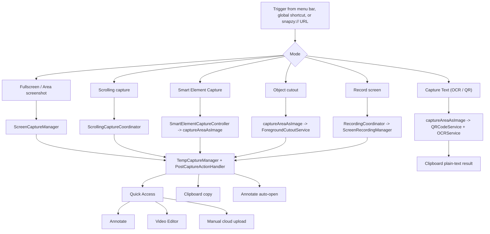
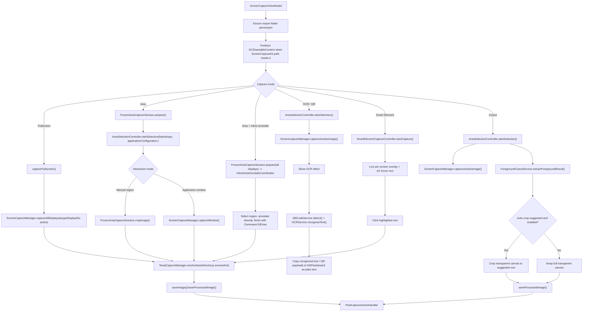
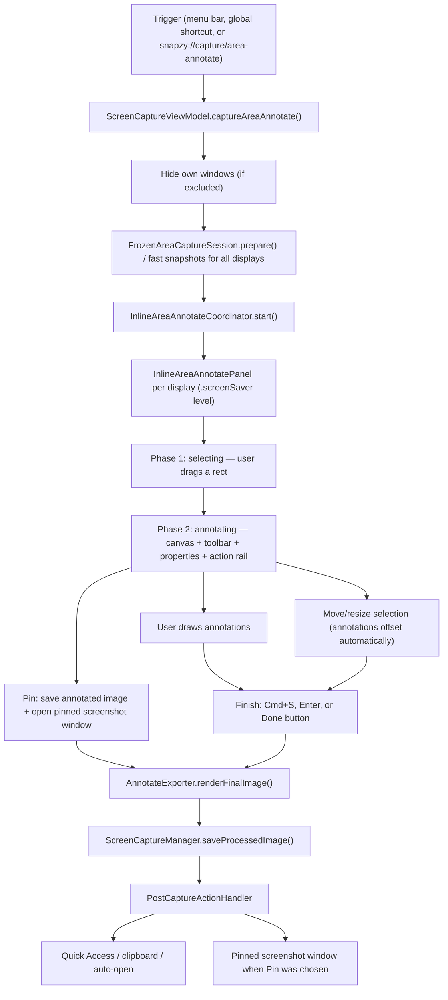
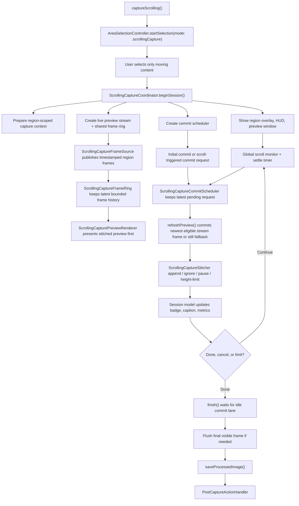
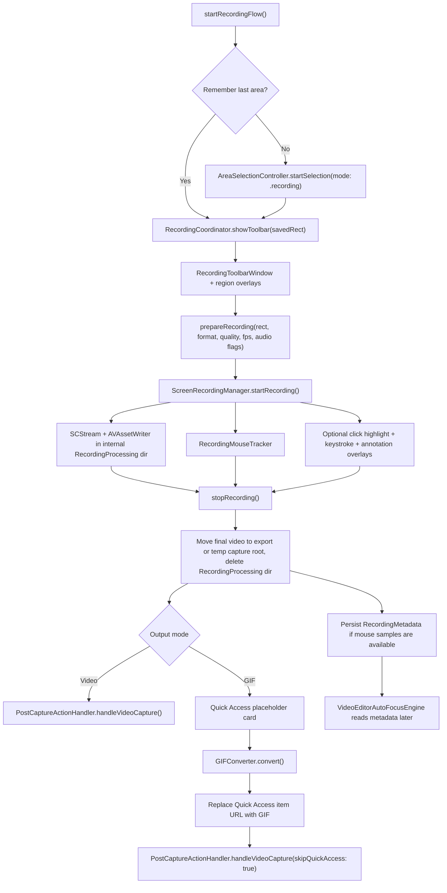
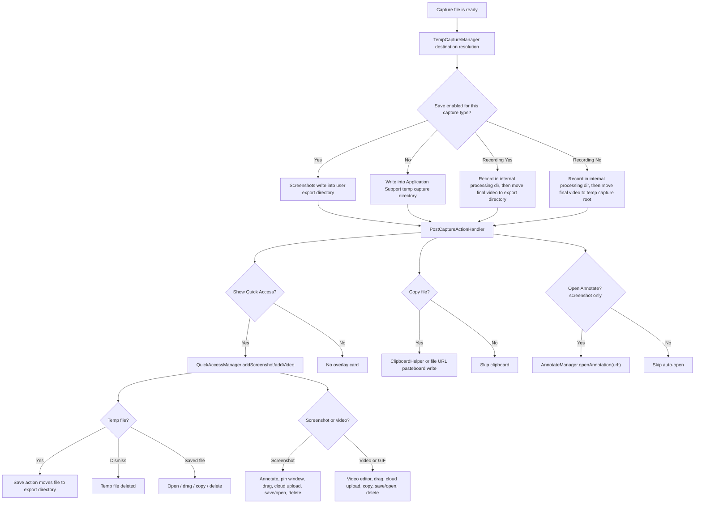
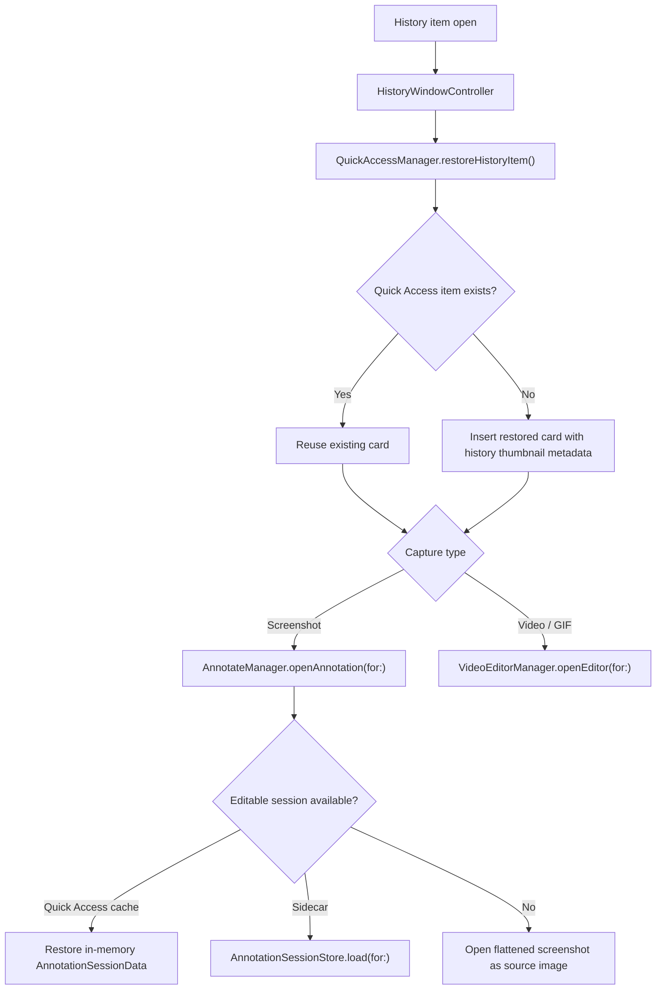
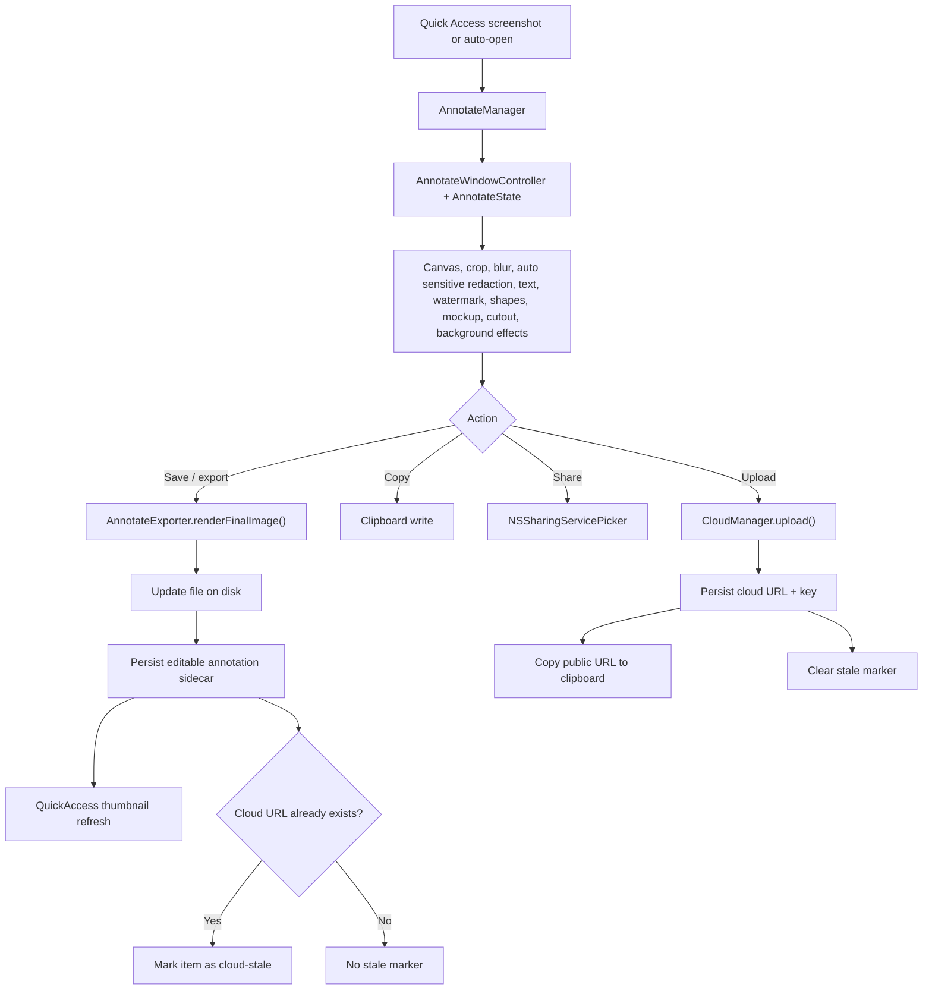
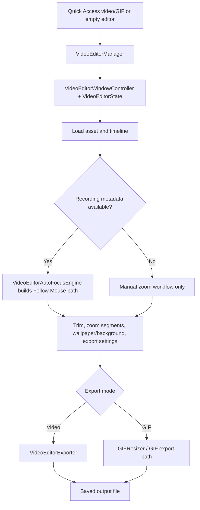

# Capture, Recording, and Editing Flows

This doc follows the runtime path from trigger to saved asset, Quick Access, editors, and cloud actions.

User-facing copy in these flows is localized through `Snapzy/Shared/Localization/L10n.swift` and `Snapzy/Resources/Localization/{Shared,Features}/*.xcstrings`. Privacy permission copy lives in `InfoPlist.strings`. For localization ownership and rules, read [`LOCALIZATION.md`](LOCALIZATION.md).

## Flow Index

## Screenshot, OCR, and Cutout

### Notes

- Fullscreen resolves the active display from `ScreenUtility.activeDisplayID()` when triggered, then runs through `ScreenCaptureManager.captureAllDisplays(targetDisplayIDs:)` so `Cmd+Shift+3` captures only the screen the user is interacting with. The hot path uses `CGDisplayCreateImage` for the target display when cursor and desktop icon/widget exclusions are off; it falls back to ScreenCaptureKit for correctness when those options are enabled.
- The fullscreen capture engine can still run without `targetDisplayIDs` for explicit all-display captures. Multi-display post-capture remains batch-aware: Quick Access and history receive every file, clipboard receives file URLs for multi-file batches, and auto-open Annotate opens only the first saved screenshot.
- Screenshot outputs use a minimum 2x pixel-density baseline. Low-density external display captures are promoted before saving so fullscreen, area, scrolling, cutout, and inline-annotated screenshots stay consistent with Retina-display output. When a selection spans Retina and non-Retina displays, the composite crop promotes and edge-enhances each low-density display slice before drawing it into the shared 2x canvas, preserving native Retina slices without re-sharpening them.
- Area screenshot freezes the active display first via `FrozenAreaCaptureSession`, then either crops from that cached snapshot or switches into exact window capture for application mode.
- Area screenshot freezes the active display first, then lazily prepares idle/hovered displays when possible. Area-selection overlay windows are excluded from screen capture, so lazy snapshots do not bake in the dim overlay or create a double-darkened backdrop. During an active cross-display drag, a newly crossed display stays live and is captured after mouse-up once the overlay has been hidden, avoiding a mid-drag freeze jump while preserving fast initial activation. Manual selection is tracked in global screen coordinates and rendered per display, so one selection rectangle can span multiple monitors.
- For screenshot sessions, the target display overlay now owns direct keyboard handling for `Escape` and the application-mode toggle key, so cancel still works when Snapzy starts from a background custom shortcut without depending on Accessibility-backed global key monitoring.
- `Cmd+Shift+4` area capture has two interaction modes inside the same overlay session: manual region by default, and application window mode toggled with the configurable `Application Capture` key (default `A`).
- Application-window capture can also start directly from the menu, independent shortcut, or `snapzy://capture/application`; it uses the same area capture flow with `.applicationWindow` as the initial interaction mode.
- Smart Element Capture is standalone. It starts from the menu, an optional user-bound global shortcut (default `Option+Shift+4`), or `snapzy://capture/smart-element`; it does not run inside the `Cmd+Shift+4` area overlay and does not freeze the desktop before hover.
- Smart Element Capture requires Accessibility permission. Startup gates through `AXIsProcessTrustedWithOptions`; without permission, Snapzy does not show the standalone overlay.
- During a Smart Element session, `SmartElementCaptureController` owns one live overlay panel per screen. `SmartElementWindowOwnerResolver` finds the topmost non-Snapzy window under the cursor, `SmartElementQueryService` uses the window PID with `AXUIElementCopyElementAtPosition`, and `AXElementInspector` normalizes AX bounds into AppKit bottom-left coordinates for highlight rendering. To ensure 60fps overlay performance, the AX queries run on a background queue with a 50ms throttle, preventing main thread blocking.
- Clicking inside the highlighted rect commits through `ScreenCaptureViewModel.captureSmartElement(rect:)`, which reuses the screenshot save and post-capture pipeline. Clicking outside the highlight or pressing `Escape` cancels without writing a capture.
- Known limitation: Chromium-based apps (Chrome, Slack, Claude desktop, Electron) may expose only `AXWebArea` for web content unless launched with `--force-renderer-accessibility` (Chromium) or `app.setAccessibilitySupportEnabled(true)` (Electron). Inside such apps the highlight may snap to the whole web view rather than individual DOM elements.
- Area + inline annotate is a separate screenshot flow with the default shortcut `Cmd+Shift+7`. Users can enable/disable or configure it from Preferences → Shortcuts. It freezes all available displays, lets the user select, move, and resize one region across the desktop coordinate space, supports both the move handle and Space-drag for moving the selected region, reuses Annotate tool models/rendering on that region, and saves the rendered image through the normal screenshot post-capture pipeline after Command-S, Enter, or Done.
- In application window mode, `AreaSelectionController` builds a front-to-back candidate list from `CGWindowListCopyWindowInfo` plus `SCShareableContent`, highlights the hovered window above the dimming overlay, and captures the selected app window on click without requiring a drag rectangle.
- Exact window capture is handled by `ScreenCaptureManager.captureWindow()`. macOS 14+ uses ScreenCaptureKit window metrics directly, then trims fully transparent capture fringe so shadow framing does not leave uneven empty canvas; macOS 13+ stays supported with the same ScreenCaptureKit path plus a safe area-capture fallback if exact capture fails.
- The frozen/manual and application-window paths both preserve existing desktop icon/widget exclusion, cursor, own-app exclusion, temp-save, Quick Access, clipboard, and annotate routing behavior.
- When own-app exclusion hides visible normal Snapzy windows for screenshot, OCR, cutout, scrolling capture, or pre-recording setup, those windows are ordered out temporarily and restored after the capture/session finishes or is cancelled.
- OCR is the only capture path that does not create a file; it captures a `CGImage`, optionally shows a lightweight OCR effect while Vision work runs, then copies text/QR payloads to the pasteboard as plain text.
- Narrow vertical CJK OCR uses a constrained recovery path inside `OCRService`: if normal Vision profiles and contrast recovery find no usable text, upright CJK glyph rows are normalized into a horizontal recovery image before retrying Vision. This keeps horizontal OCR unchanged while improving traditional vertical text layouts.
- The OCR effect is controlled by `PreferencesKeys.ocrScanningOverlayEnabled` from Capture → Screenshot → OCR and is enabled by default.
- QR detection runs as local Vision work alongside OCR where possible, with capture/processing duration logged for latency checks.
- QR payload handling is passive by design: Snapzy does not open decoded URLs, perform network requests, load WebViews, execute processes, or write QR payloads as file URL pasteboard items.
- Object cutout is macOS 14+ only. JPEG is overridden to PNG because transparency must be preserved.
- Capture toasts, alerts, open-panel prompts, and error surfaces are localized through `L10n`.

## Capture Markup (Inline Area Annotate)

Capture Markup lets the user select a screen region and annotate it *before* saving — inside coordinated per-display overlays that share one desktop coordinate space. It bridges capture and editing into one continuous flow without opening the separate Annotate editor window.

### Inline Overlay Shortcuts

| Key | Action |
| --- | --- |
| `Enter` / `Return` | Finish and save |
| `⌘S` | Finish and save |
| `⌘C` | Copy current annotated image to clipboard |
| `Esc` | Cancel and close |
| `Space` (hold) | Move selection (shows open-hand cursor) |
| `V` | Selection tool |
| `R` | Rectangle |
| `F` | Filled Rectangle |
| `O` | Oval |
| `A` | Arrow |
| `L` | Line |
| `T` | Text |
| `H` | Highlighter |
| `B` | Blur |
| `N` | Counter |
| `W` | Watermark |
| `P` | Pencil |

### Supported Tools

The inline overlay reuses the same drawing engine as the full Annotate editor and supports: Selection, Rectangle, Filled Rectangle, Oval, Arrow, Line, Text, Highlighter, Blur, Counter, Watermark, and Pencil.

Crop and Mockup are **not** available in the inline overlay (full editor only).

### Interaction Details

- **Move selection**: Hold `Space` and drag, or use the move handle in the toolbar.
- **Resize selection**: Drag any of the 8 handles (corners + edges) around the selection; cursor feedback changes per edge.
- **Quick Properties Bar**: Appears below the toolbar when a drawable tool is active. Shows context-aware controls: primary color, text background, blur type, arrow style and bend direction, watermark text/style/opacity/rotation, stroke width, font size, corner radius. Filled Rectangle applies the primary color to both border and fill. Favorite colors are capped at 4 per role to match the visible quick swatches. By default, tool defaults such as primary color, stroke width, font size, corner radius, and watermark opacity/rotation are shared across compatible tools when no specific annotation is selected; users can turn off Settings → Annotate → Sync tool defaults to keep per-tool defaults independent. Selected-item numeric edits stay local to that annotation; slider drags are grouped into one undo checkpoint. Selected-item primary color edits update future defaults only while sync is enabled.
- **Action Rail**: Side rail with Pin-to-Screen, Cancel, Done (prominent), and Copy-to-Clipboard. Pin saves the current annotated image, runs the normal screenshot post-capture pipeline once, then opens the saved image in a pinned screenshot window.
- **Multiple displays**: Capture Markup freezes every available display before showing the overlay, opens one coordinated panel per frozen display, maps display frames into one desktop coordinate space, tracks cross-display drags with a shared monitor, and uses `FrozenAreaCaptureSession.cropCompositeImage()` when the selected region spans display boundaries.
- **Cross-Spaces**: The overlay is an `NSPanel` at `.screenSaver` level with `canJoinAllSpaces` and `fullScreenAuxiliary`, so it works across Spaces.

### Notes

- The global shortcut for Capture Markup is enabled by default for new installs. Users can turn it off in Preferences → Shortcuts. The default key is `⇧⌘7`.
- The overlay reuses `AnnotateState`, `CanvasDrawingView`, and `AnnotateExporter` — no duplicated annotation logic.
- Moving or resizing the selected region refreshes the underlying cropped image while **preserving existing annotations** via `replaceSourceImagePreservingAnnotations(_:annotationOffset:)`.
- Cropped source images derive their display scale from the captured bitmap, return their pixel-aligned screen rect, and Capture Markup updates the visible selection to that rect so Retina and external-display previews stay 1:1 with the backing bitmap instead of being resampled. Low-density external-display crops are promoted after crop to the minimum Retina output scale with native vImage resampling plus bounded edge enhancement, preserving fast native snapshot acquisition while avoiding 1x images being stretched in Annotate. Mixed-display composite crops apply that promotion per low-density slice rather than only when the whole capture is low-density.
- Single-display selections still use the per-display crop path; cross-display selections use the same composite crop path as frozen area capture.
- Finishing routes through the normal screenshot post-capture pipeline, so clipboard copy, Quick Access, auto-open, and history all behave identically to a standard area screenshot. Clipboard copy runs before Quick Access work so pasteboard updates stay immediate even if thumbnail generation or overlay presentation is slow.
- Keyboard handling uses both local and global `NSEvent` monitors to catch `Space`, `Enter`, `Esc`, `Cmd+S`, and `Cmd+C` reliably. `Cmd+C` only copies the rendered inline capture when the overlay owns the event (local event or key overlay window), and active text editing keeps native text copy behavior.

## Scrolling Capture

### Notes

- The subsystem in `Services/Capture/ScrollingCapture/` is intentionally self-contained: preview, stitcher, HUD, metrics, commit scheduling, and window placement all live there.
- The live stream is a low-latency frame source, not the primary visual result after capture starts.
- Scrolling capture prepares region frames with the same minimum 2x screenshot baseline, so long screenshots from non-Retina external displays do not save as 1x output.
- The preview rail prioritizes the stitched preview image so the visible result grows as accepted slices are merged.
- The preview lane and commit lane share the same bounded frame timeline through `ScrollingCaptureFrameRing`; still capture is now a fallback when the stream has no usable new frame.
- `previewTruthState` indicates whether stitched output is captured, syncing to uncommitted scroll, paused, or finalizing.
- Vision is a recovery tool inside `ScrollingCaptureStitcher`, not the default hot path.
- `ScrollingCaptureStitchUpdate.safety` marks confirmed versus unsafe stitch outcomes; final output is built from accepted slices only.
- After the first frame is locked, the HUD can start Auto Scroll. Snapzy posts accessibility-backed scroll-wheel events at the selected region while the pointer remains inside it, pauses with guidance if the pointer leaves, resumes when it returns, auto-finishes on likely bottom/height-limit, and stops auto-scroll on repeated alignment failure so the user can continue manually.
- Debug sessions emit `ScrollingCaptureDebug` lines to `~/Library/Logs/Snapzy/snapzy_YYYY-MM-DD.txt`; filter them with `grep 'ScrollingCaptureDebug' "$HOME/Library/Logs/Snapzy/snapzy_$(date +%F).txt"` when validating frame source, append deltas, confidence, safety, and final session summary.
- Session guidance, runtime badges, preview captions, and recovery toasts are localized and should stay in sync with `docs/LOCALIZATION.md`.

## Recording, GIF Output, and Smart Camera

### Notes

- Recording metadata is stored separately from the media file and powers Smart Camera / Follow Mouse in the video editor.
- Recording media is written to a per-session internal `Application Support/Snapzy/Captures/RecordingProcessing/` directory first. When the writer finishes, Snapzy moves only the final video into the user export folder when Save is enabled, or into the temp capture root when Save is disabled, then deletes the processing directory and AVAssetWriter sidecars.
- Recording cursor inclusion is controlled by `PreferencesKeys.recordingShowCursor` and defaults to enabled to preserve the historical behavior. The toolbar Options popover and Capture → Recording settings share the same state before `ScreenRecordingManager` writes it to `SCStreamConfiguration.showsCursor`.
- Recorded system and microphone audio tracks are encoded as AAC-LC at 48 kHz stereo with an explicit stereo channel layout. When multiple audio sources are present, Snapzy normalizes the user-facing recording to one mixed AAC-LC stereo audio track for broad MP4/MOV compatibility across common players and upload platforms, while storing an editor-only multitrack audio source sidecar plus explicit track-role metadata for later per-source volume edits.
- The pre-record toolbar exposes system audio as a one-click speaker toggle next to the microphone menu. The Options popover now keeps format, quality, and overlay controls while audio capture can be changed without opening it.
- Microphone input selection is persisted in `PreferencesKeys.recordingMicrophoneDeviceID`. Preferences and the recording toolbar expose the macOS system default plus available built-in/external audio input devices; `MicrophoneAudioCapturer` uses the selected device and falls back to the current system default if the stored device is unavailable.
- The recording toolbar mic button keeps its existing icon chrome but opens a native macOS menu: `Do Not Use Microphone` first, then `System Default Microphone`, then currently available built-in/external microphone devices. Selecting a device enables microphone capture for that recording toolbar state and stores the chosen device id. The Options popover no longer duplicates microphone input selection.
- GIF output is a two-step flow: record video first, then convert and swap the Quick Access item.
- `RecordingCoordinator` owns toolbar and overlay UX. `ScreenRecordingManager` owns media capture, timing, and metadata persistence.
- `AppStatusBarController` stays menu-first during active recording. The menu bar item keeps Snapzy's normal identity, shows the live elapsed time, and exposes stop plus pause/resume from the menu instead of left-click-to-stop.
- Opening Preferences from the menu bar during recording keeps Settings reachable without forcing a stop. When own-app capture is enabled, the active recording stream dynamically excludes that Settings window.
- Application-window recording can start directly from the menu, independent shortcut, or `snapzy://record/application`; it uses the normal recording setup flow with `.applicationWindow` as the initial interaction mode.
- Recording toolbar labels, output mode copy, microphone/save-folder alerts, and export errors are localized.
- The pre-record recording region overlay (`RecordingRegionOverlayWindow`) supports cross-display drag, resize, and reselect. `RecordingRegionOverlayView` installs local + global `NSEvent` monitors on gesture start so the interaction continues seamlessly when the pointer crosses a screen boundary. Movement and resize are clamped to the unified desktop frame (union of all `NSScreen.screens` frames) instead of individual screen bounds. `SCStream` still records from a single `SCDisplay` — the display with the largest overlap wins — so the selection can be repositioned freely across displays but the captured content comes from one display.

## Post-Capture Routing

### Notes

- `AfterCaptureAction.save` is not a post-write callback. For screenshots it changes the destination before write; for recordings it chooses the final destination after the internal writer processing file is complete.
- Recording clipboard copy uses `ClipboardHelper.copyMediaFile(from:)`, which keeps the AppKit file-URL write for sandbox handoff and adds same-item URL/string fallbacks for Teams/Electron/WebView paste targets.
- Current cloud behavior is manual from Quick Access for screenshots, videos, and GIFs, plus Annotate for screenshots. The preference toggle enables those affordances; it does not auto-upload in `PostCaptureActionHandler`.
- Quick Access countdowns pause while a card is converting to GIF or uploading to cloud, then resume after the active work finishes.
- Temp captures are intentionally stored in Application Support, not `/tmp`, so drag-and-drop remains stable.
- Quick Access cards expose hover actions plus a matching context menu, opened with the cursor near the tail actions, for copy, save/open, edit, cloud upload, dismiss, and delete/trash actions. Cards also support mouse swipe-to-dismiss and optional two-finger horizontal swipe-to-dismiss on the preview, using the same edge-aware close direction as the panel position. Temp captures show Save; captures that already live in their final destination keep the same slot visible as Open, even when the after-capture Save preference is off. Assigned actions that are present but unavailable, such as already-uploaded cloud actions or screenshot-only actions on video cards, stay visible in a disabled state. Settings → Quick Access lets users toggle actions and drag list rows to reorder the context menu. Card placement is separate: users drag actions onto the preview's center and corner slots, or drag preview and swipe-zone actions outside the card to clear them to an empty state.
- Screenshot pin opens a separate always-on-top pin window. Closing it or pressing Esc while unlocked unpins the Quick Access item; lock mode keeps the screenshot on top, fades the image on mouse-over, and passes pointer events through to underlying apps except the unlock control.
- Pinned screenshot windows size from the source image aspect ratio, keep a minimum interactive footprint for tiny captures, fit inside the active screen, and expose compact zoom and drag-to-app controls. Users can zoom naturally with a trackpad pinch or Command-scroll, and the window resizes around its current center.
- Quick Access action labels and post-capture error states are localized.

## Capture History Restore

### Notes

- Opening a capture from either history surface restores the item through Quick Access before opening the editor.
- History restore reuses an existing Quick Access card for the same file when one is already present, so the editor keeps the same item-scoped session and avoids extra disk reads.
- Screenshot history restore first tries the Quick Access in-memory `AnnotationSessionData`, then the persisted annotation sidecar, then falls back to opening the flattened image if no valid editable session exists.
- Annotation sidecars live under `~/Library/Application Support/Snapzy/AnnotationSessions/<sha256-normalized-source-path>/`. Each package stores `manifest.json`, `original.bin`, optional `cutout.png`, and embedded image assets referenced by annotations.
- The sidecar manifest binds the editable session to the source screenshot using normalized path hash plus a file signature (`size`, `modifiedAt`, `extension`). If the user or another app replaces the screenshot at the same path, Snapzy ignores the stale sidecar instead of restoring annotations onto the wrong pixels.
- Screenshot, video, and GIF saves from restored history items follow the same Quick Access session behavior as fresh captures. Restored files that are already saved expose Open in the save/open slot instead of hiding the action.
- Sidecar cleanup is tied to the same lifecycle as the source screenshot: Quick Access delete, Annotate delete-image, History delete, clear-history, and retention sweeps remove matching sidecars. Saving a temp Quick Access item to the export folder moves the sidecar to the new source path, with a cached-session re-persist fallback.
- Retention cleanup also prunes orphan sidecars whose source screenshot no longer exists, no longer has an active history record, or no longer matches the stored signature.
- Editable history persistence is commit-based, not live autosave. Unsaved edits in an open Annotate window still follow the existing unsaved-change prompt/window lifecycle; Snapzy does not create draft recovery sidecars on app quit.
- Performance contract: no per-edit disk writes and no polling watcher. Sidecars are read only when opening a screenshot for annotation and written after committed save/share/upload flows, so normal annotation interaction stays memory-only.

## Annotate and Cloud Re-Upload

### Notes

- Annotate windows cache session state per Quick Access item so the user can reopen the same card and keep editing. Committed screenshot sessions are also persisted through `AnnotationSessionStore`, so a restored History screenshot can continue editing previous annotations instead of only reopening the flattened output.
- Persisted annotate sessions include the original image bytes, annotation items, canvas/background effects, crop state, cutout state/data, and embedded image assets. The final screenshot file remains the rendered user-facing image.
- Session persistence happens after committed actions: save, save-and-close, copy/close with save, successful drag-to-app save, cloud upload/re-upload save, inline area annotate finish, and default-preset auto-apply during post-capture routing.
- Canvas presets can be marked as the default for new full Annotate windows and include background style, blurred background effect, spacing, shadow, corner radius, aspect ratio, and ratio orientation. Session restore keeps the cached canvas effects, and inline area annotate does not auto-apply this window default.
- Screenshot default-preset auto-apply uses the lightweight `AnnotateExporter.renderCanvasEffects(sourceImage:effects:)` path. It derives `AnnotationCanvasEffects` directly from the selected preset, renders the committed screenshot file, and returns editable session data without constructing a full `AnnotateState`.
- Full Annotate sidebar background effects include gradients, wallpapers, solid colors, and blurred presets. The blurred presets combine with the selected wallpaper or solid color background, precompute image-backed blur for preview performance, and render through the same exporter path used by save, copy, and drag-to-app.
- Blur annotations render through a non-blocking preview cache in the editor. Cache misses draw a lightweight placeholder, background work is coalesced per annotation, and final save/copy/share/export still renders through the deterministic exporter path.
- Auto sensitive redaction is a trigger action inside the quick properties bar of the blur annotation tool. It runs local Vision OCR plus deterministic detectors for emails, phone numbers, URLs, payment card-like numbers, credentials, and common access tokens, then creates editable pixelated blur annotations in one undo checkpoint. It does not persist recognized text or bake redaction pixels until the normal export/copy/save path renders the image.
- Watermark annotations are editable items with text, style, opacity, size, rotation, and color controls; export/copy/share/upload render them through the same final image pipeline as other annotations.
- The crop tool can shrink or expand the editable canvas. Dragging crop handles outside the source image creates empty canvas space that accepts the same annotations as the original image area and is included in export/copy/share/upload.
- Drag-to-app starts with a lazy file promise and guarantees a rendered file-URL fallback for apps that do not support file promises, so the first drag attempt can be accepted by file-url-only targets.
- When Annotate saves a Quick Access screenshot, any open pin window receives the newly rendered image immediately; pin drag-to-app uses the current pinned pixels so saved edits are included even while the file write finishes in the background.
- `Close after drop` in Settings → Annotate controls successful full-editor drag-to-app completion. It defaults on, preserving the existing behavior: Snapzy saves current edits back to the source file and dismisses the Quick Access card. When off, drag-to-app shares a rendered copy, keeps the Quick Access card/session cache, and leaves unsaved edits/source file state unchanged until explicit Save or Copy & Close. `Reactivate after drop` then controls whether the preserved editor is activated after a successful drop or restored quietly in the background.
- Manually opened Annotate windows from the menu bar, global shortcut, or toolbar plus button are independent, so users can work with multiple clipboard/drop sessions side by side.
- If a screenshot was already uploaded, later edits mark the cloud state stale until the user re-uploads.
- Annotate dialogs, preset actions, mockup labels, cutout/export alerts, and cloud re-upload messaging are localized.

## Video Editor

### Notes

- Video preview and export apply custom volume through the same `AVAudioMix` path so Custom Volume changes are audible before saving.
- For Snapzy recordings that have an editor audio source sidecar, the editor loads that multitrack asset for preview/export while keeping save/replace operations pointed at the user-facing compatible video file.
- When the editor source exposes separate audio tracks, the editor uses stored track-role metadata keyed by `AVAssetTrack.trackID` to map system audio and microphone controls, falling back to `ScreenRecordingManager` writer order for older metadata. Custom volume preview and export share the same role-aware `AVAudioMix` path.
- Editor exports are normalized back to one mixed AAC-LC stereo audio track after multitrack export so saved files stay broadly compatible. Single-track videos keep one mixed volume control.
- Existing recordings created before the editor audio source sidecar exists contain one mixed audio track, so the editor cannot recover separated microphone/system sources from those older files.

## Key Files

| File | Responsibility |
| --- | --- |
| `Snapzy/Shared/Localization/L10n.swift` | Shared localization bridge for these flows |
| `Snapzy/Resources/Localization/{Shared,Features}/*.xcstrings` | Split runtime String Catalogs backing translated flow copy |
| `Snapzy/Features/Capture/CaptureViewModel.swift` | Entry point for screenshot, scrolling capture, OCR, cutout, and recording launch |
| `Snapzy/Services/Capture/OCRScanningOverlayWindow.swift` | Non-interactive scanning progress overlay for OCR area capture |
| `Snapzy/Services/Media/QRCodeService.swift` | Local QR payload detection for OCR capture |
| `scripts/run-qr-detection-performance-probe.sh` | Local Vision QR timing probe for OCR latency checks |
| `Snapzy/Services/Capture/ScreenCaptureManager.swift` | Core screenshot engine, frozen snapshot capture, and file writing |
| `Snapzy/Services/Capture/FrozenAreaCaptureSession.swift` | Frozen display snapshots used by area screenshot selection |
| `Snapzy/Services/Capture/PostCaptureActionHandler.swift` | Clipboard-first Quick Access and screenshot auto-open routing |
| `Snapzy/Services/Capture/ScreenshotPresetAutoApplier.swift` | Lightweight default canvas preset render and editable session creation during post-capture routing |
| `Snapzy/Services/Capture/TempCaptureManager.swift` | Save-vs-temp destination logic and temp capture lifecycle |
| `Snapzy/Services/Capture/ScrollingCapture/ScrollingCaptureCoordinator.swift` | Long screenshot session orchestration |
| `Snapzy/Services/Capture/ScrollingCapture/ScrollingCaptureStitcher.swift` | Stitching and Vision-assisted recovery |
| `Snapzy/Features/Recording/RecordingCoordinator.swift` | Recording toolbar, overlays, stop/GIF handoff |
| `Snapzy/Services/Capture/ScreenRecordingManager.swift` | Screen recording media pipeline and metadata persistence |
| `Snapzy/Features/QuickAccess/QuickAccessManager.swift` | Floating stack state and countdown behavior |
| `Snapzy/Features/QuickAccess/Models/QuickAccessActionConfigurationStore.swift` | User-configurable Quick Access action visibility, context menu order, and card slot assignments |
| `Snapzy/Features/QuickAccess/Components/QuickAccessCardView.swift` | Card hover and context-menu actions including screenshot, video, and GIF cloud upload |
| `Snapzy/Features/QuickAccess/Managers/QuickAccessPinWindowManager.swift` | Independent always-on-top pinned screenshot windows |
| `Snapzy/Features/History/HistoryWindowController.swift` | History restore routing through Quick Access |
| `Snapzy/Features/Annotate/AnnotateManager.swift` | Annotate window lifecycle and session caching |
| `Snapzy/Features/Annotate/Services/AnnotationSessionStore.swift` | Persistent sidecar storage for committed editable screenshot annotation sessions |
| `Snapzy/Features/Annotate/Models/PersistedAnnotationSession.swift` | Codable sidecar manifest and persisted annotation models |
| `Snapzy/Features/Annotate/InlineAreaAnnotateSession.swift` | Session state machine (selecting → annotating), key handling, finish/cancel |
| `Snapzy/Features/Annotate/InlineAreaAnnotateWindow.swift` | Full overlay UI: selection gesture, canvas, toolbar, properties bar, action rail, resize handles |
| `Snapzy/Features/Annotate/Services/AnnotateExporter.swift` | Final image render/export plus lightweight canvas-effect rendering for screenshot default presets |
| `Snapzy/Services/History/CaptureHistoryRetentionService.swift` | History retention, media cleanup, thumbnail cleanup, and orphan annotation sidecar cleanup |
| `Snapzy/Features/VideoEditor/VideoEditorManager.swift` | Video editor window lifecycle |
| `Snapzy/Features/VideoEditor/Services/VideoEditorAutoFocusEngine.swift` | Follow Mouse / Smart Camera path reconstruction |
| `Snapzy/Services/Cloud/CloudManager.swift` | Upload facade, provider creation, history persistence |
