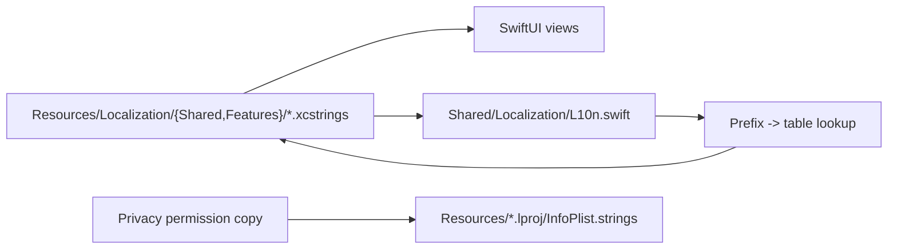

# Localization Architecture

This doc describes how Snapzy localizes user-facing text today. Keep it synced with source, not with intended future work.

## Current State

- Source language: `en`
- Supported app locales: `en`, `vi`, `zh-Hans`, `zh-Hant`, `es`, `ja`, `ko`, `ru`, `fr`, `de`
- Language selection: Snapzy supports app language selection in Preferences and a first-run onboarding language step. Preferences still relies on the macOS app-language override plus relaunch behavior, while onboarding previews the selected locale immediately inside the onboarding flow and only commits the override when onboarding finishes.
- Source-of-truth and runtime catalogs: centralized under `Snapzy/Resources/Localization/`, split into `Shared/*.xcstrings` and `Features/*.xcstrings`
- Coverage: menu bar, onboarding, preferences, capture flows, recording flows, Quick Access, Annotate, Video Editor, cloud dialogs, alerts, toasts, and scrolling capture HUD/status text

## Runtime Model



## File Map

| Path | Owns |
| --- | --- |
| `Snapzy/Resources/Localization/Shared/*.xcstrings` | Cross-feature runtime String Catalog fragments |
| `Snapzy/Resources/Localization/Features/*.xcstrings` | Feature-owned runtime String Catalog fragments |
| `Snapzy/Resources/Localization/Generated/` | Reserved location for generated localization artifacts |
| `Snapzy/Resources/Localization/manifest.json` | Prefix ownership for the split runtime catalogs |
| `tools/localization/CatalogTool.swift` | Audit and verify workflow for split catalogs |
| `Snapzy/Shared/Localization/L10n.swift` | Shared localization bridge for AppKit strings, alerts, toasts, `displayName`, `errorDescription`, and text that does not auto-extract cleanly from SwiftUI |
| `Snapzy/Resources/*.lproj/InfoPlist.strings` | Privacy usage descriptions per locale |
| `Snapzy.xcodeproj/project.pbxproj` | Project regions and String Catalog related build settings |

## Working Rules

- Localize all user-facing copy.
- Edit the owning fragment in `Snapzy/Resources/Localization/Shared/` or `Snapzy/Resources/Localization/Features/`.
- Prefer `L10n` for AppKit, service-layer errors, toasts, open-panel prompts, and shared model labels.
- Keep raw ids and persisted values stable. Localize at the display layer, not in storage models.
- Use `Text(verbatim:)` or other explicit verbatim rendering for tokens that should stay raw.
- Keep keys inside the fragment that owns their prefix in `manifest.json`.
- Keep these intentionally unlocalized unless product behavior changes:
  - Brand names like `Snapzy`
  - File formats such as `PNG`, `JPEG`, `WebP`, `MOV`, `MP4`
  - Keyboard glyphs and shortcut key labels
  - MIME types, UTType ids, URL fragments, and file-name templates
- If a short technical token stays verbatim in UI, add localized accessibility text when needed.

## Coverage Notes

- Capture and recording flows route their user-facing status, toast, and alert copy through `L10n`.
- Scrolling capture uses localized HUD labels, guidance copy, preview captions, and toast messages.
- Annotate and Video Editor surfaces are localized, including shared tool labels, dialogs, export messaging, and empty states.
- Preferences, onboarding, Quick Access, menu bar, and cloud flows are localized.
- The onboarding welcome screen renders a multilingual greeting cluster with verbatim native greetings from the supported app locales.
- The onboarding language step defaults to `Auto`, previews the effective locale immediately through `OnboardingLocalizationController`, commits the app-language override through `AppLanguageManager` when onboarding completes, and relaunches only at the end when the effective language actually changed.
- Privacy permission prompts come from `InfoPlist.strings`, not from the split runtime catalogs.

## Verification

- Drift check between `L10n*.swift` and the split runtime catalogs should stay `missing=0` and `extra=0`.
- Verify fragment ownership and `L10n` coverage with:

```bash
swift -module-cache-path build/swift-module-cache tools/localization/CatalogTool.swift verify
```

- Build with:

```bash
xcodebuild -project Snapzy.xcodeproj -scheme Snapzy -configuration Debug -derivedDataPath /tmp/SnapzyDerivedData build CODE_SIGNING_ALLOWED=NO
```

- Hardcoded user-facing copy check should come back empty for app code outside previews/tests.

## Unresolved Questions

- None right now.
